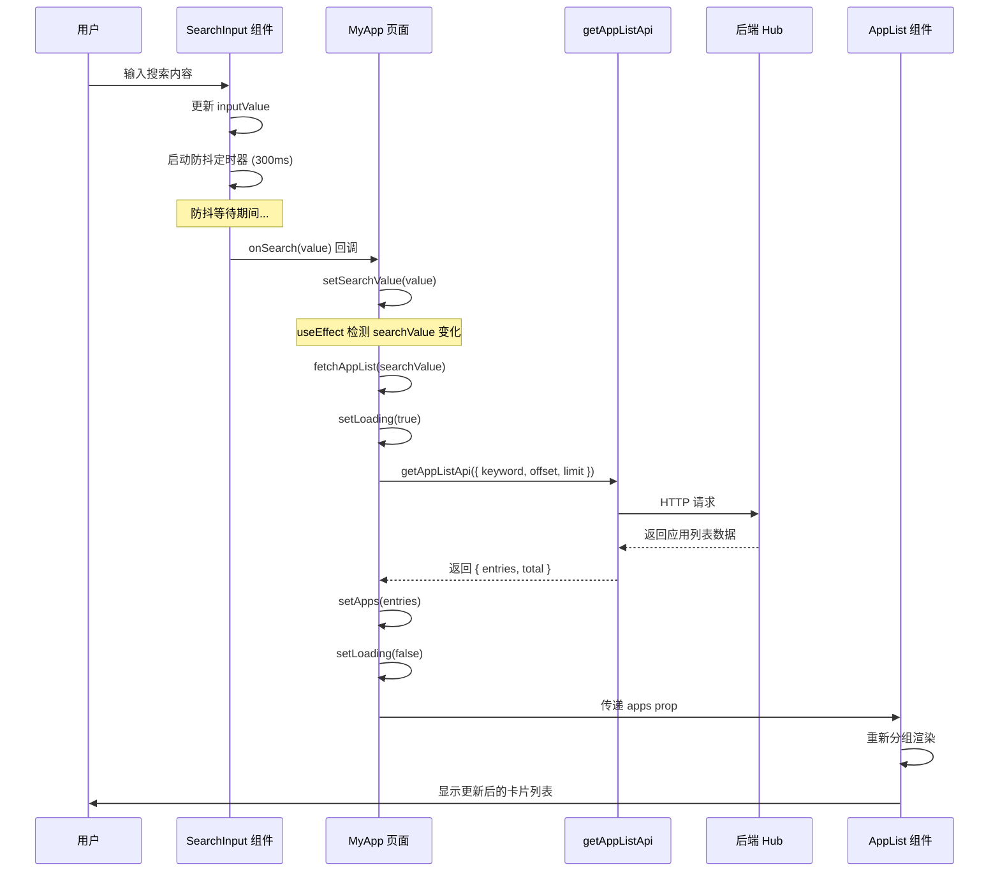
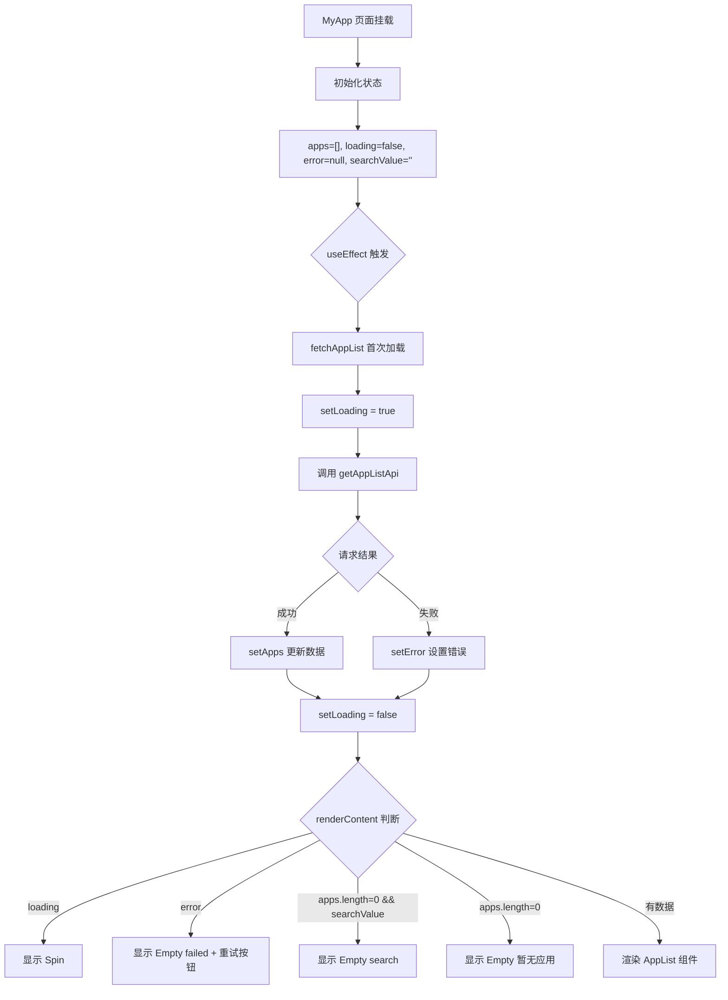
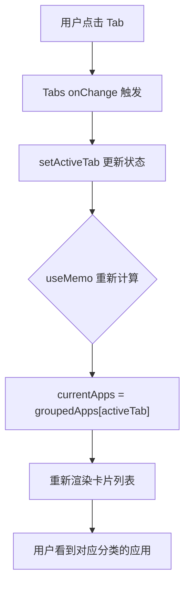
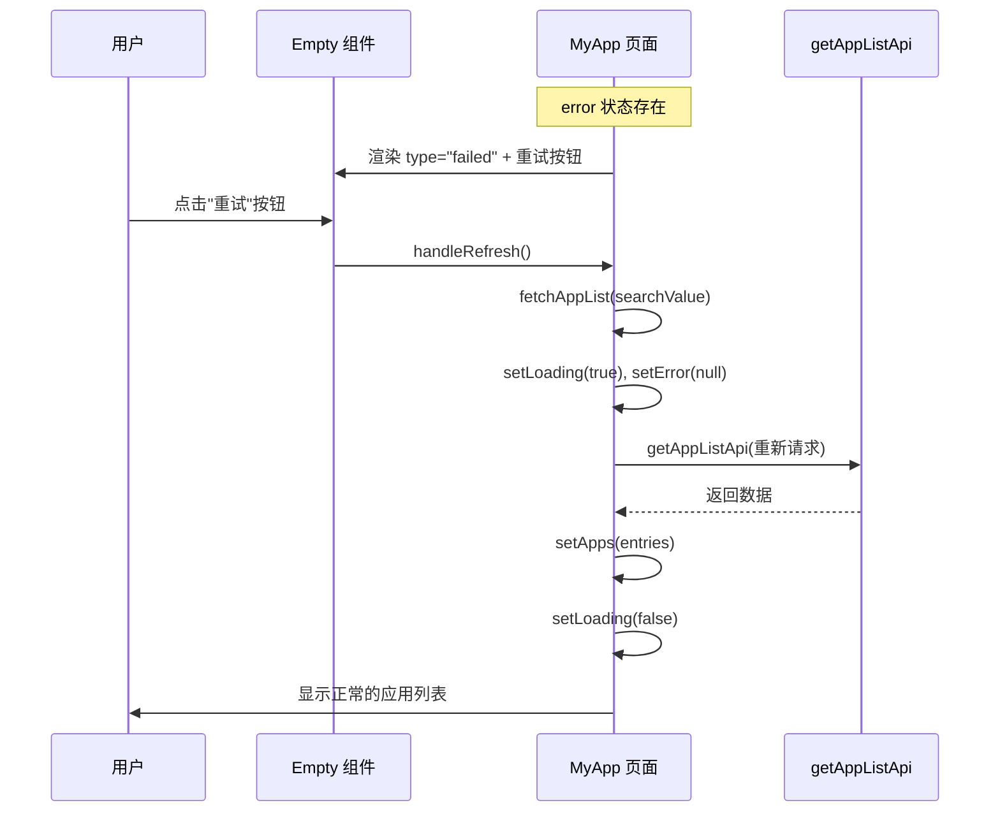
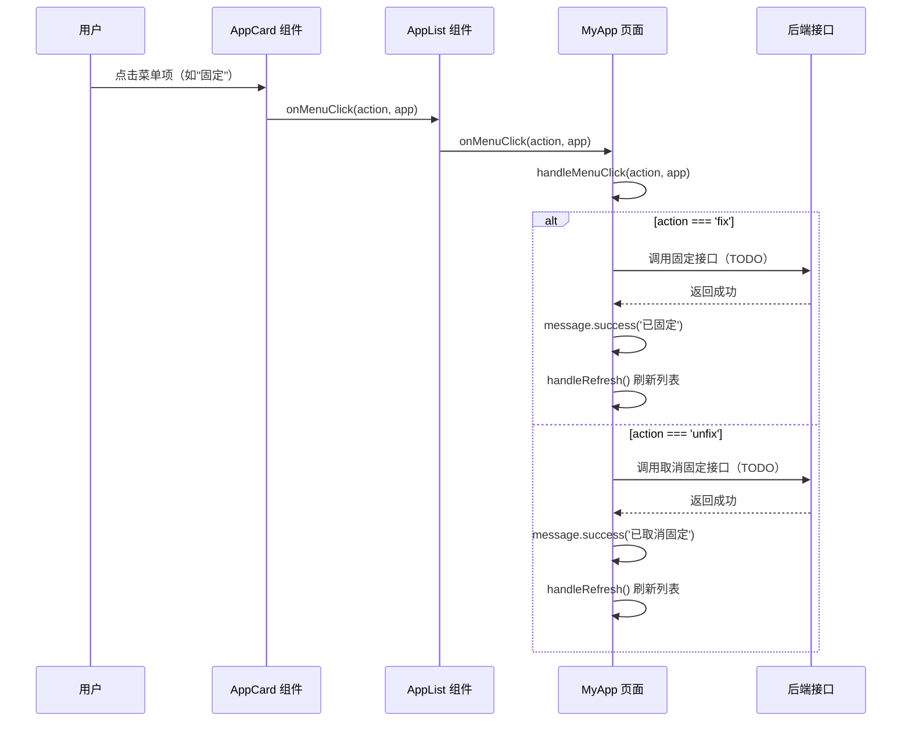
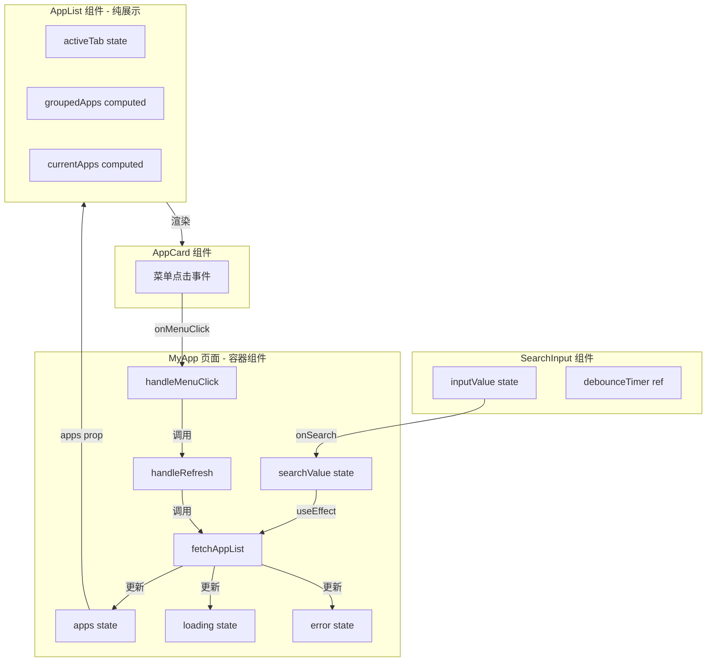

# MyApp 页面逻辑设计文档

## 一、组件结构拆分

```
MyApp (页面入口，容器组件)
├── GradientContainer       # 渐变背景容器
├── SearchInput             # 搜索输入框组件
├── Empty                   # 空状态/错误状态展示
├── Spin                    # 加载状态指示器
└── AppList                 # 应用列表展示组件（纯展示）
    ├── Tabs                # 分类 Tab 切换
    └── AppCard             # 应用卡片组件
```

---

## 二、组件详细设计

### 2.1 MyApp（页面容器组件）

**文件位置**: `src/pages/MyApp/index.tsx`

#### 职责

- 管理数据获取逻辑
- 管理页面状态（loading/error/empty）
- 处理搜索和卡片操作
- 统一渲染状态 UI

#### 内部状态

| 状态名        | 类型             | 初始值  | 说明         |
| ------------- | ---------------- | ------- | ------------ |
| `apps`        | `AppInfo[]`      | `[]`    | 应用列表数据 |
| `loading`     | `boolean`        | `false` | 是否正在加载 |
| `error`       | `string \| null` | `null`  | 错误信息     |
| `searchValue` | `string`         | `''`    | 搜索关键词   |

#### 核心方法

| 方法名            | 参数                           | 说明             |
| ----------------- | ------------------------------ | ---------------- |
| `fetchAppList`    | `keyword: string`              | 获取应用列表数据 |
| `handleRefresh`   | 无                             | 刷新数据         |
| `handleSearch`    | `value: string`                | 处理搜索         |
| `handleMenuClick` | `action: string, app: AppInfo` | 处理卡片菜单操作 |

#### 子组件传参

| 子组件        | 参数                                                | 说明         |
| ------------- | --------------------------------------------------- | ------------ |
| `SearchInput` | `onSearch: handleSearch`, `placeholder: "搜索应用"` | 搜索框回调   |
| `AppList`     | `mode`, `apps`, `onMenuClick`                       | 应用列表展示 |

---

### 2.2 SearchInput（搜索输入框组件）

**文件位置**: `src/components/SearchInput/index.tsx`

#### Props 接口

```typescript
interface SearchInputProps extends Omit<InputProps, 'onChange' | 'value'> {
  onSearch?: (value: string) => void // 搜索值变化回调（防抖后触发）
  debounceDelay?: number // 防抖延迟时间（毫秒），默认 300ms
  defaultValue?: string // 初始搜索值
}
```

#### 内部状态

| 状态名       | 类型     | 初始值         | 说明         |
| ------------ | -------- | -------------- | ------------ |
| `inputValue` | `string` | `defaultValue` | 输入框当前值 |

#### Ref 引用

| 引用名            | 类型                     | 说明                       |
| ----------------- | ------------------------ | -------------------------- |
| `debounceTimer`   | `NodeJS.Timeout \| null` | 防抖定时器                 |
| `lastSearchValue` | `string`                 | 上一次搜索的值（用于去重） |

---

### 2.3 AppList（应用列表展示组件）

**文件位置**: `src/components/AppList/index.tsx`

#### 职责

- 纯展示组件，不负责数据获取
- 根据 `appType` 动态分组 Tab 展示
- 响应式卡片布局

#### Props 接口

```typescript
interface AppListProps {
  mode: ModeEnum.MyApp | ModeEnum.AppStore // 显示模式
  apps: AppInfo[] // 应用列表数据
  onMenuClick?: (action: string, app: AppInfo) => void // 卡片菜单点击回调
}
```

#### 内部状态

| 状态名      | 类型     | 初始值        | 说明           |
| ----------- | -------- | ------------- | -------------- |
| `activeTab` | `string` | `ALL_TAB_KEY` | 当前激活的 Tab |

#### 计算属性 (useMemo)

| 属性名        | 类型                        | 说明                  |
| ------------- | --------------------------- | --------------------- |
| `groupedApps` | `Record<string, AppInfo[]>` | 按 appType 分组的应用 |
| `appTypes`    | `string[]`                  | 所有应用类型列表      |
| `currentApps` | `AppInfo[]`                 | 当前 Tab 下的应用列表 |
| `tabItems`    | `TabItem[]`                 | 动态生成的 Tab 配置   |

---

### 2.4 AppCard（应用卡片组件）

**文件位置**: `src/components/AppList/AppCard.tsx`

#### Props 接口

```typescript
interface AppCardProps {
  app: AppInfo // 应用信息
  mode: ModeEnum.MyApp | ModeEnum.AppStore // 显示模式
  cardWidth: number // 卡片宽度
  onMenuClick?: (key: string, app: AppInfo) => void // 菜单点击回调
}
```

---

### 2.5 Empty（空状态组件）

**文件位置**: `src/components/Empty/index.tsx`

#### Props 接口

```typescript
interface IEmpty {
  type?: 'empty' | 'search' | 'failed' // 空状态类型
  iconSrc?: any // 自定义图标路径
  iconHeight?: number // 图标高度，默认 144
  desc?: React.ReactElement | string // 主描述文字
  subDesc?: React.ReactElement | string // 副描述文字
  children?: React.ReactElement // 额外内容（如按钮）
}
```

---

## 三、类型定义

### 3.1 页面类型

**文件位置**: `src/pages/MyApp/types.ts`

```typescript
/** 我的应用操作枚举 */
enum MyAppActionEnum {
  Fix = 'fix', // 固定
  Unfix = 'unfix', // 取消固定
}
```

### 3.2 组件类型

**文件位置**: `src/components/AppList/types.ts`

```typescript
// 显示模式
enum ModeEnum {
  MyApp = 'myApp', // 我的应用
  AppStore = 'appStore', // 应用商店
}

// 全部 Tab 的 key
const ALL_TAB_KEY = 'all'
```

### 3.3 API 类型

**文件位置**: `src/apis/app-development/index.d.ts`

```typescript
/** 应用固定状态 */
enum AppFixedStatus {
  Unfixed = 'unfixed', // 未固定
  Fixed = 'fixed', // 已固定
}

/** 应用信息 */
interface AppInfo {
  appId: string // 应用 ID
  appName: string // 应用名称
  appDescription?: string // 应用描述
  appIcon?: string // 应用图标 URL
  createTime?: number // 创建时间
  updateTime?: number // 更新时间
  version?: string // 版本号
  createdBy?: string // 创建人
  createdByName?: string // 创建人名称
  fixedStatus?: AppFixedStatus // 固定状态
  appType?: string // 应用类型（用于 Tab 分组）
}

/** 获取应用列表请求参数 */
interface GetAppListParams {
  keyword: string // 搜索关键词
  offset: number // 页码
  limit: number // 每页数量
}
```

---

## 四、API 接口

### getAppListApi

**文件位置**: `src/apis/app-development/index.ts`

```typescript
function getAppListApi(params: GetAppListParams): Promise<PageResponse<AppInfo>>
```

---

## 五、交互流程图

### 5.1 搜索流程



### 5.2 初始加载流程



### 5.3 Tab 切换流程



### 5.4 错误重试流程



### 5.5 卡片操作流程



---

## 六、数据流向图



---

## 七、关键实现细节

### 7.1 数据获取策略

- **实现位置**: `MyApp` 页面组件
- **触发时机**: 组件挂载时 + `searchValue` 变化时（通过 useEffect）
- **加载量**: 一次性加载 1000 条数据（无分页）

### 7.2 防抖搜索

- **实现位置**: `SearchInput` 组件
- **延迟时间**: 300ms（可配置）
- **去重机制**: 通过 `lastSearchValue` ref 避免重复搜索相同值
- **即时触发**: 按下 Enter 键立即触发搜索

### 7.3 Tab 动态分组

- **实现位置**: `AppList` 组件
- **分组依据**: 后端返回的 `appType` 字段
- **默认 Tab**: "全部" (ALL_TAB_KEY)
- **Tab 重置**: 当 appTypes 变化且 activeTab 不存在时，自动重置为"全部"

### 7.4 响应式布局

- **实现方式**: 使用 `react-virtualized-auto-sizer` 自动计算容器宽度
- **列数计算**: `computeColumnCount(width)` 函数根据宽度动态计算列数
- **卡片宽度**: `(width - gap * (count - 1)) / count` 动态计算

### 7.5 状态 UI 渲染

- **优先级**: loading > error > empty > 正常内容
- **空状态区分**: 搜索无结果显示 "抱歉，没有找到相关内容"，无应用显示 "暂无可用应用"
